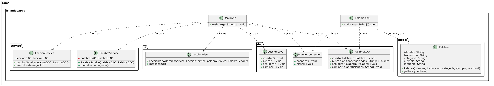

# 🇮🇸 IslandesApp

**IslandesApp** es una aplicación de escritorio desarrollada en Java cuyo objetivo es facilitar el aprendizaje del idioma islandés mediante lecciones organizadas, vocabulario clasificado y ejemplos prácticos.

Este proyecto ha sido desarrollado como Trabajo de Fin de Grado (TFG) por **James Francis Bastian** dentro del programa del Máster del Grupo Atrium.

---

## 📚 Funcionalidades principales

- ✅ Gestión y visualización de lecciones  
- ✅ Consulta de palabras y traducciones con sus ejemplos  
- ✅ Asociación de vocabulario a lecciones específicas  
- ✅ Interfaz gráfica intuitiva y funcional (Swing)  
- ✅ Persistencia de datos con MongoDB  
- ✅ Separación en capas con patrones MVC y DAO  
- ✅ Pruebas unitarias con JUnit  
- ✅ Documentación generada con JavaDoc  

---

## 🛠️ Tecnologías utilizadas

- ☕ Java 17  
- 🗃️ MongoDB  
- 📦 Maven  
- 🧪 JUnit 5  
- 🖥️ Swing (Java UI)  
- 💡 Eclipse IDE  

---

## 📁 Estructura del proyecto

IslandesApp/
├── src/
│ └── main/
│ └── java/
│ └── com/
│ └── islandesapp/
│ ├── dao/
│ ├── model/
│ ├── service/
│ ├── ui/
│ └── MainApp.java
│ └── resources/
│ └── docs/
│ ├── diagramas/
│ └── memoria/
│ └── memoria.md
├── tests/
│ └── islandesapp/
│ └── service/
│ └── LeccionServiceTest.java
├── pom.xml
├── .gitignore
└── README.md
---

## 🧠 Diagrama de clases



---

## 📦 Compilación y ejecución

Para compilar y ejecutar la aplicación usando Maven:

```bash
mvn clean compile
mvn exec:java -Dexec.mainClass="com.islandesapp.MainApp"

```bash
mvn clean compile
mvn exec:java -Dexec.mainClass="com.islandesapp.MainApp"

🧪 Tests
Las pruebas unitarias están implementadas con JUnit 5 para validar la lógica del servicio.

Para ejecutar los tests: mvn test

Los tests se encuentran en src/test/java/islandesapp/service/.

📖 Documentación JavaDoc
Para generar la documentación JavaDoc completa del proyecto: mvn javadoc:javadoc

La documentación se generará en target/site/apidocs/index.html. Abre ese archivo con un navegador para consultarla.

Autor
James Francis Bastian
Email: jamesbastianfrancis@hotmail.com

Licencia
Este proyecto se ha desarrollado con fines educativos como Trabajo de Fin de Grado Atrium.